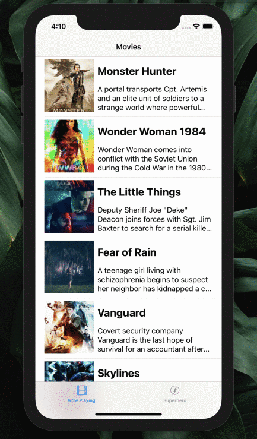

# Flix

Flix is an app that allows users to browse movies from the [The Movie Database API](http://docs.themoviedb.apiary.io/#).

## Flix Part 2

### User Stories

#### REQUIRED (10pts)
- [X] (5pts) User can tap a cell to see more details about a particular movie.
- [X] (5pts) User can tap a tab bar button to view a grid layout of Movie Posters using a CollectionView.

#### BONUS
- [ ] (2pts) User can tap a poster in the collection view to see a detail screen of that movie.
- [ ] (2pts) In the detail view, when the user taps the poster, a new screen is presented modally where they can view the trailer.

### App Walkthrough GIF
 

* GIF created with [Recordit](http://www.recordit.co)
---

## Flix Part 1

### User Stories

#### REQUIRED (10pts)
- [X] (2pts) User sees an app icon on the home screen and a styled launch screen.
- [X] (5pts) User can view and scroll through a list of movies now playing in theaters.
- [X] (3pts) User can view the movie poster image for each movie.

#### BONUS
- [ ] (2pt) User can view the app on various device sizes and orientations.
- [ ] (1pt) Run your app on a real device.

### App Walkthrough GIF

* GIF created with [Recordit](http://www.recordit.co) //  https://imgur.com/vZF5MpV

### Notes
Overall I found the walkthrough videos to be easy to understand and insightful, as I was able to learn a lot about Swift and Xcode. While working on the project, I did struggle a bit on trying to understand the template for the ViewController where we had to code in Swift. While Swift is a bit similar to Javascript, I am still new to IOS development so trying to understand the logic behind the process was a bit difficult. A problem that had me stumped for a few hours was trying to properly commit the project to GIT. I kept running into the same error (pathsec) and it turns out all I needed to do was restart my computer for the push to go through successfully. For the first project, I had a lot of fun building it and I look forward to adding new features in the upcoming weeks!
